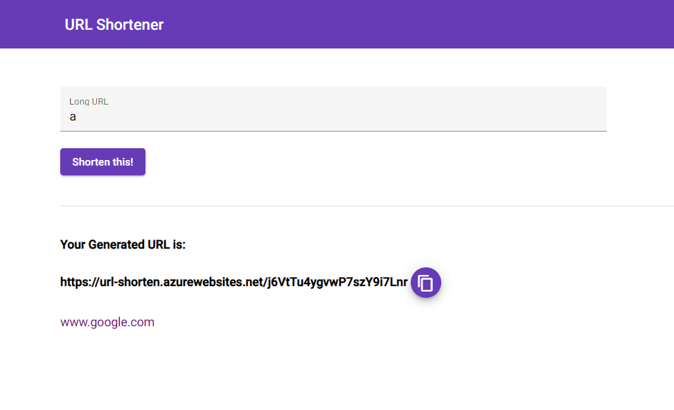
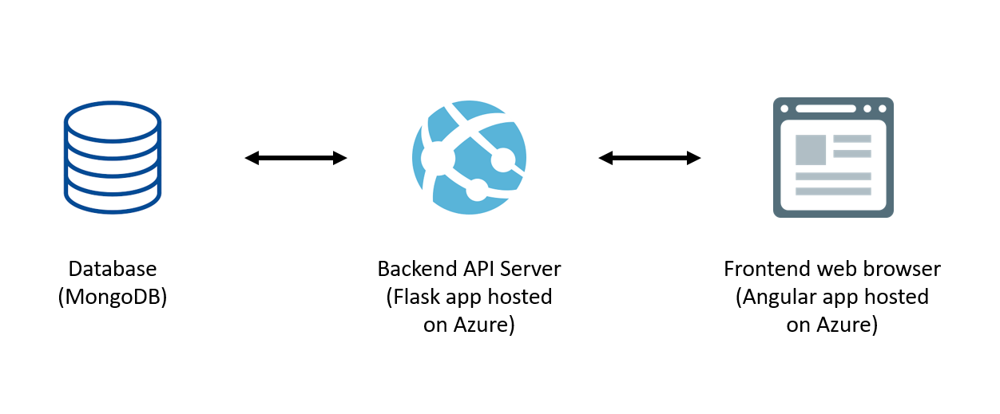

# URL Shortener Application

The application website is hosted at [https://shorten-my-url.azurewebsites.net/](https://shorten-my-url.azurewebsites.net/).

This application acts as a typical URL shortening service, where it allows users to shorten long URLs into URLs which are of the form `https://url-shorten.azurewebsites.net/xxxxxxxx`.

The detailed functionality of the application is as follows:
1. Users can use either the [website](https://shorten-my-url.azurewebsites.net/) or the backend [API endpoint](https://url-shorten.azurewebsites.net/) to submit a long URL and request for a short one to be generated.
2. The backend server checks for the validity of the given URL. Only valid URLs are processed.
3. The backend server keeps a persistent database of all shortened URLs, and reuses shortened URLs when a previously submitted long URL is submitted again.

## Architecture
This application uses a simple database-backend-frontend architecture.

Technologies used:
- Database: _MongoDB Atlas_
- Backend: _Flask_ web framework, hosted as a _Azure Web App_
- Frontend: _Angular_, hosted as a _Azure Web App_

## Frontend
### Deployment to Azure
This [link](https://nicolgit.github.io/how-deploy-angular-app-to-azure-appservice-running-linux-from-github/) also provides a detailed guide.

1. Create a Web App on Azure, using _Node_ as the Stack.
2. Push the code to GitHub.
3. Use the _Deployment Center_ to set up a build and deploy pipeline via _GitHub Actions_. Use the `.yml` file provided in this repository.
4. Edit the configurations.
   - Under _Configuration_ > _Application Settings_, add an application setting: `Name`: `WEBSITE_WEBDEPLOY_USE_SCM`; `Value`: `1`
   - Under _Configuration_ > _General Settings_, set the _Startup Command_ to: `pm2 serve /home/site/wwwroot --no-daemon --spa`
5. The app should be running at `<app-name>.azurewebsites.net`. Every time a new commit is added to the GitHub repository, the app will be deployed automatically to Azure.

### Local development
- Install the Angular CLI using `npm install -g @angular/cli`.
- At the project folder root, install dependencies using `npm install`, then build and serve the app using `ng serve`.

### Environment Variables
Configure in the `environments/` folder.

| Variable                    | Description                                                                                                                    |
|-----------------------------|--------------------------------------------------------------------------------------------------------------------------------|
| APIEndpoint                 | The endpoint for the backend API server.       

## Backend API Server
### API Documentation
Refer to this Swagger page for the [API Documentation](https://app.swaggerhub.com/apis-docs/ngkc1996/url-shortener/1.0.0).

### Code Repository
Refer to this github [link](https://github.com/ngkc1996/url-shortener-backend) for the backend server code.
